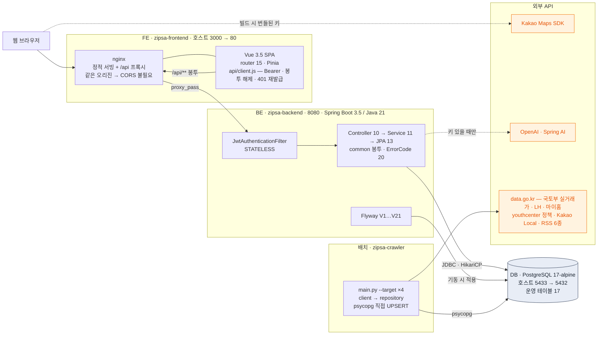
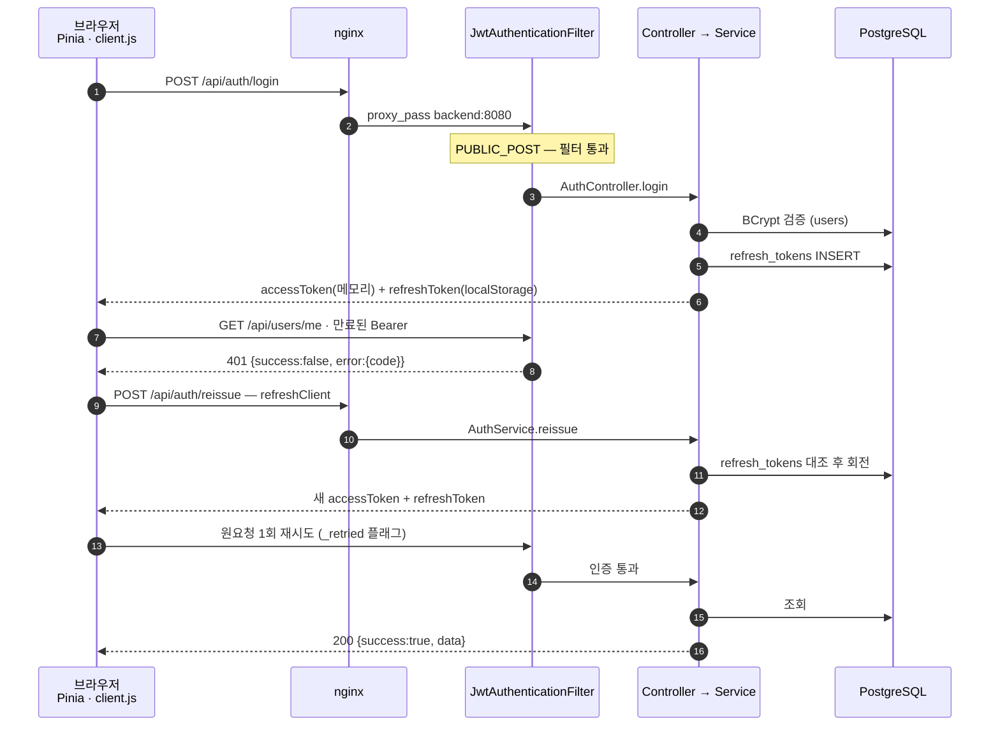
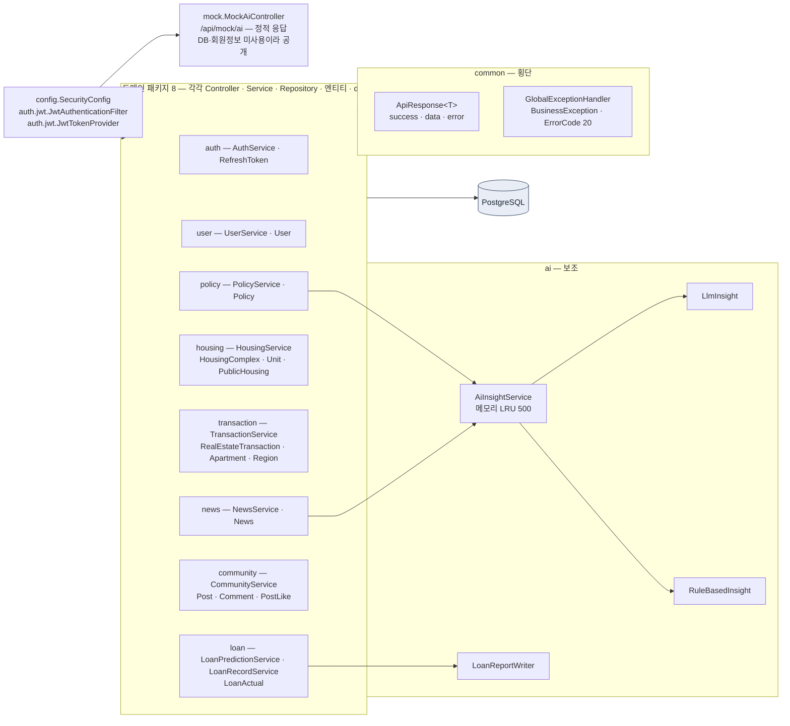
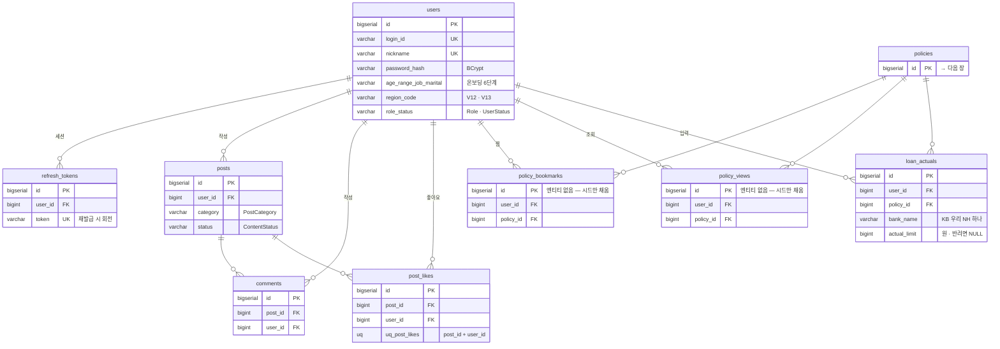
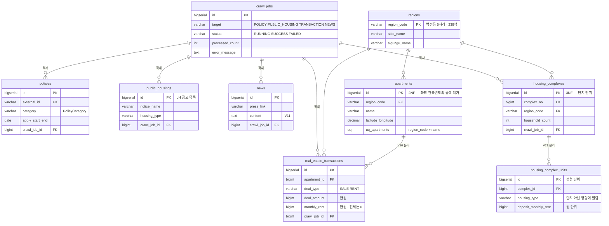
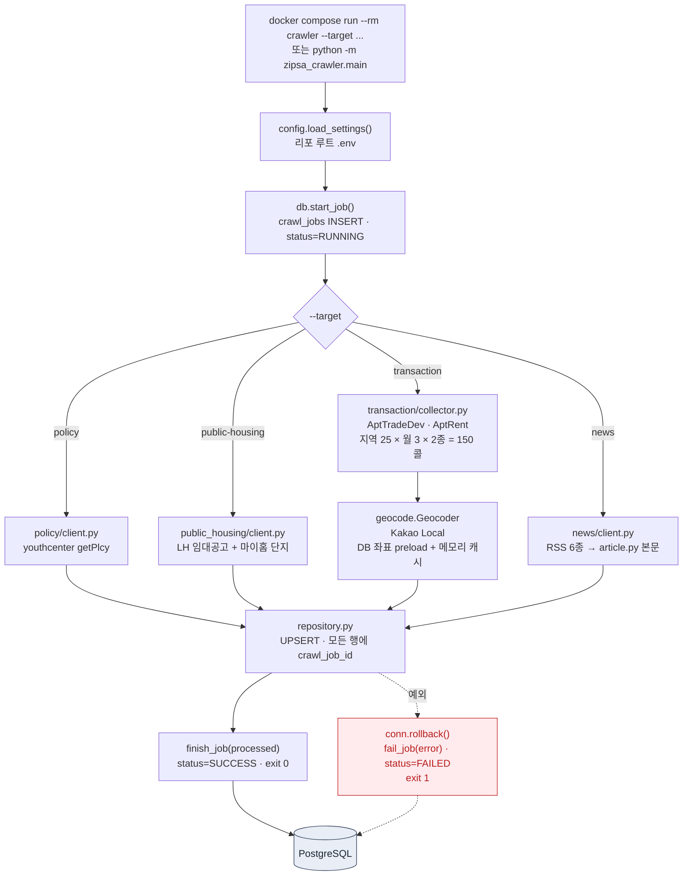
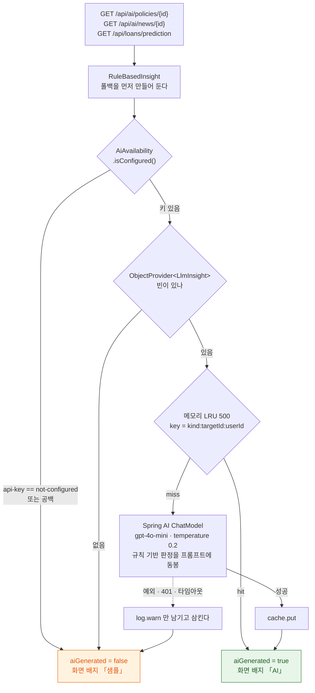

# ZipSa 시스템 아키텍처

> 코드에서 직접 읽어 그린 문서입니다 — `docker-compose.yml`, `frontend/src/`, `backend/src/main/`,
> `crawler/zipsa_crawler/`, `db/migration/V1~V21`. 추측으로 그린 상자는 없습니다.
> 구조를 바꿨다면 이 문서를 고치고 `python3 scripts/build_architecture_pdf.py` 를 다시 돌리세요.
> 출력물: [ZipSa-시스템아키텍처.pdf](ZipSa-시스템아키텍처.pdf)

<!-- pdf-block title="한눈에 보기" desc="문서 전체에서 쓰는 숫자입니다. 코드를 세어 얻은 값이라, 여기가 틀리면 뒤의 그림도 틀립니다." src="2026-09-03 기준 · main 브랜치 작업 트리" -->

| 항목 | 수 | 비고 |
| --- | --- | --- |
| 프론트 라우트 / View | 15 / 16 | `PlaceholderView.vue` 는 라우터에 연결돼 있지 않음 |
| 프론트 API 모듈 | 8 + `client.js` | 컴포넌트는 axios 를 직접 부르지 않음 |
| REST 컨트롤러 | 10 | 도메인 9 + 목업 1 (`/api/mock/ai`) |
| 서비스 (`@Service`) | 11 | + `LlmInsight` · `LoanReportWriter` (`@Component`) |
| JPA 엔티티 / 리포지토리 | 14 / 13 | `ddl-auto=validate` — 스키마는 Flyway 가 단독 관리 |
| Flyway 마이그레이션 | V1 … V21 | 운영 DB 에 21개 전부 `success=t` |
| 운영 테이블 | 17 | V18 에서 4개 제거, V20·V21 에서 2개 신설 |
| 크롤 타깃 | 4 | policy · public-housing · transaction · news |
| 외부 API | 8종 | 1번 그림 |

---

## 1. 전체 구조 — FE · BE · DB

<!-- pdf title="전체 구조 — FE · BE · DB" desc="백엔드가 유일한 외부 진입점입니다. 프론트는 DB 를 모르고, DB 는 nginx 뒤에 있습니다. 예외는 둘 — 브라우저가 직접 로드하는 카카오 지도 SDK 와, API 를 거치지 않고 DB 에 직접 쓰는 크롤러 배치." src="docker-compose.yml · frontend/nginx.conf · frontend/vite.config.js · backend/src/main/resources/application.yml" -->



**변하지 않는 규칙 두 가지**

1. **백엔드가 유일한 외부 진입점입니다.** 유일한 예외는 카카오 지도 SDK — 브라우저가 직접 로드합니다.
2. **크롤러는 API 를 거치지 않고 DB 에 직접 씁니다.** 상주 서비스가 아니라 배치라서 `docker compose up` 으로는 뜨지 않고, `docker compose run --rm crawler --target ...` 으로만 돕니다.

---

## 2. 프로젝트 폴더 구조

<!-- pdf-block title="프로젝트 폴더 구조" desc="한 리포에 FE · BE · 크롤러 · 문서가 같이 있습니다. 셋이 공유하는 것은 리포 루트의 .env 하나와 DB 스키마뿐입니다." src="작업 트리 실측 · node_modules · .venv · build 산출물 제외" -->

```text
ZipSa/
├── docker-compose.yml          db · backend · frontend · crawler(batch)
├── .env                        ← FE · BE · 크롤러가 공유하는 단 하나의 환경변수 파일 (커밋 금지)
├── .env.example                커밋되는 견본
│
├── frontend/                   Vue 3.5 · Vite 6 · Pinia 2 · axios 1.7
│   ├── nginx.conf              /api → backend:8080 프록시 · SPA fallback
│   ├── vite.config.js          envDir=리포 루트 · dev 프록시 :5173 → :8080
│   └── src/
│       ├── api/                client.js + 도메인 8 (auth policy housing transactions
│       │                       news community loan ai) — 컴포넌트는 axios 직접 호출 금지
│       ├── stores/             auth.js (Pinia) — Access 는 메모리, Refresh 는 localStorage
│       ├── router/             15 라우트 · meta.requiresAuth 가드
│       ├── views/              16 화면 (PlaceholderView 는 미연결)
│       ├── components/         AiInsight AiSlot BankBadges DetailDrawer RichContent
│       ├── composables/        useKakaoMap.js
│       ├── constants/          bank policy housing community
│       └── utils/              richText.js
│
├── backend/                    Spring Boot 3.5.0 · Java 21 · Spring AI 1.0.0
│   ├── build.gradle            web · data-jpa · security · validation · actuator
│   │                           flyway · jjwt 0.12.6 · springdoc 2.8.9
│   └── src/main/
│       ├── java/com/zipsa/     ── 계층이 아니라 도메인으로 나눕니다 ──
│       │   ├── config/         SecurityConfig
│       │   ├── common/         ApiResponse · ErrorCode(20) · GlobalExceptionHandler
│       │   ├── auth/           + jwt/ (Filter · TokenProvider · Properties)
│       │   ├── user/ policy/ housing/ transaction/ news/ community/ loan/
│       │   │                   각 패키지 = Controller + Service + Repository + 엔티티 + dto/
│       │   ├── ai/             AiAvailability · AiInsightService · LlmInsight · RuleBasedInsight
│       │   └── mock/           MockAiController — AI 연동 전 프론트용 정적 응답
│       └── resources/
│           ├── application.yml
│           └── db/migration/   V1 … V21  ← 스키마의 유일한 원천
│
├── crawler/                    Python 3.11 · psycopg 3
│   └── zipsa_crawler/
│       ├── main.py             --target 진입점 · crawl_jobs 기록
│       ├── config.py           리포 루트 .env 로드 · require() 로 키 검증
│       ├── db.py               커넥션 · start/finish/fail_job
│       ├── policy/ news/ public_housing/    client.py + repository.py
│       └── transaction/        + collector.py · geocode.py (Kakao Local)
│
├── scripts/                    운영·검증 도구 (전부 python3 단독 실행)
│   ├── check_keys.py           외부 API 키 인코딩까지 검증
│   ├── seed_dev_data.py        더미 회원·정책·조회로그 (시드 고정)
│   ├── verify_seed.sql         심어둔 선호 패턴이 복원되는지 확인
│   ├── discover_regions.py
│   └── build_{sequence,api_spec,architecture}_pdf.py   문서 → PDF
│
└── docs/
    ├── architecture.md         ← 이 문서
    ├── DB.dbml                 dbdiagram.io 붙여넣기용 ERD
    ├── api/                    README(공통 규약) · API.yml(OpenAPI 3.0)
    ├── design/                 결정 기록
    └── diagrams/               시퀀스 다이어그램 SVG · PNG
```

**세 모듈이 공유하는 것은 둘뿐입니다.** 리포 루트 `.env` 와 DB 스키마.
그래서 컬럼을 바꿀 때는 백엔드·크롤러 양쪽 합의 후 **새 마이그레이션**으로 추가하고 `docs/DB.dbml` 도 같이 고칩니다.
이미 적용된 마이그레이션 파일은 수정하지 않습니다 — Flyway 체크섬이 깨져 팀원 DB 가 전부 기동 실패합니다.

---

## 3. 요청 한 번이 지나는 길

<!-- pdf title="요청 경로 — 인증과 토큰 재발급" desc="Access 는 메모리에만, Refresh 는 localStorage. 재발급 전용 axios 인스턴스에는 인터셉터를 달지 않아 401 → 재발급 → 401 무한루프가 원천적으로 생기지 않습니다." src="config/SecurityConfig.java · auth/jwt/JwtAuthenticationFilter.java · frontend/src/api/client.js · frontend/src/stores/auth.js" -->



<!-- pdf-block title="접근 정책 — SecurityConfig 는 순서가 곧 규칙" desc="2번을 4번보다 먼저 걸어야 합니다. 뒤에 두면 /api/policies/** 가 먼저 매칭돼 비로그인도 통과합니다." src="backend/src/main/java/com/zipsa/config/SecurityConfig.java" -->

| 순서 | 매처 | 결과 |
| --- | --- | --- |
| 1 | `OPTIONS /**` | permitAll |
| 2 | `GET /api/policies/recommend`, `GET /api/policies/bookmarks` | **authenticated** |
| 3 | `POST /api/auth/signup`, `/login`, `/reissue` | permitAll |
| 4 | `GET` — `/api/auth/check-id`, `/api/policies/**`, `/api/public-housings/**`, `/api/transactions/**`, `/api/regions/**`, `/api/posts/**`, `/api/news/**`, `/api/mock/**`, `/swagger-ui/**`, `/v3/api-docs/**`, `/actuator/health` | permitAll |
| 5 | 나머지 전부 | authenticated |

인증 실패도 공통 봉투(`{success:false, error:{code, message}}`)로 내려갑니다.
`authenticationEntryPoint` · `accessDeniedHandler` 를 직접 구현한 이유가 이것입니다 — 프론트가 한 갈래로 처리할 수 있어야 합니다.

---

## 4. 백엔드 내부 구조

<!-- pdf title="백엔드 — 도메인 패키지와 의존 방향" desc="패키지는 계층이 아니라 도메인으로 나뉩니다. 의존은 항상 Controller → Service → Repository 한 방향이고, 공통 봉투와 오류 코드가 모든 응답을 감쌉니다." src="backend/src/main/java/com/zipsa/** · common/ApiResponse.java · common/GlobalExceptionHandler.java" -->



`mock.MockAiController` 는 AI 연동 전에 프론트가 화면을 붙여볼 수 있게 둔 **정적 응답 목업**입니다.
DB 도 회원 정보도 쓰지 않아 공개로 열려 있습니다. 실제 AI 는 `ai` 패키지이고, 응답의 `aiGenerated` 로 둘을 구분합니다.

---

## 5. 데이터 모델

17개를 한 장에 넣으면 글씨가 읽히지 않아 **회원이 만드는 데이터**와 **크롤러가 적재하는 데이터**로 나눠 그립니다.
두 덩어리를 잇는 다리는 `policies`(크롤러가 적재 → 회원이 찜·조회) 하나뿐입니다.

<!-- pdf title="데이터 모델 ① — 회원이 만드는 데이터" desc="users 를 중심으로 커뮤니티·정책 상호작용·대출 이력이 붙습니다. policies 는 크롤러가 적재하는 쪽(다음 장)이라 여기서는 참조만 합니다." src="db/migration/V1 · V2 · V7 · V12~V14 · docs/DB.dbml" -->



<!-- pdf title="데이터 모델 ② — 크롤러가 적재하는 데이터" desc="모든 적재 행이 crawl_job_id 를 답니다. 잘못 넣었을 때 DELETE WHERE crawl_job_id = ? 로 실행 단위 되돌리기가 됩니다. V20·V21 에서 apartments·housing_complexes 를 분리했습니다." src="db/migration/V1 · V8 · V9 · V20 · V21 · crawler/**/repository.py" -->



읽을 때 주의할 점 셋

- **`policy_views` · `policy_bookmarks` 는 표만 있고 Java 엔티티가 없습니다.** 지금은 `scripts/seed_dev_data.py` 만 채웁니다. 추천(`PolicyService.recommend`)은 규칙 기반이라 이 표를 읽지 않습니다.
- **금액 단위가 표마다 다릅니다.** 실거래가는 **만원**, 공공임대·대출은 **원**. V18 에서 DB 주석으로 못을 박아 뒀습니다.
- **V18 이 4개 표를 걷어냈습니다** — `policy_ai_summaries`(메모리 캐시로 대체), `loan_estimates`(결정적 계산이라 저장할 사실이 없음), `public_housing_bookmarks`(와이어프레임에 없음), 그리고 `public_housing_complexes` 는 V21 에서 `housing_complexes` + `housing_complex_units` 로 분해됐습니다.

---

## 6. DB 연동 확인

<!-- pdf-block title="DB 연동 확인 — 컨테이너 · 스키마 · 적재 현황" desc="문서가 그린 경로가 실제로 통하는지 확인한 결과입니다. 손으로 쓴 표가 아니라 아래 명령을 그대로 실행해 얻었습니다." src="docker compose 스택 · 2026-09-03 실측" -->

**확인 명령**

```bash
docker compose ps                                             # 컨테이너 상태
docker exec zipsa-db psql -U zipsa -d zipsa -c '\dt'          # 테이블 목록
docker exec zipsa-db psql -U zipsa -d zipsa \
  -c 'SELECT version, description, success FROM flyway_schema_history ORDER BY installed_rank;'
docker exec zipsa-backend curl -fsS localhost:8080/actuator/health
curl -s http://localhost:3000/api/regions                     # 브라우저와 같은 경로로 관통
```

**① 컨테이너 · 연결**

| 대상 | 결과 |
| --- | --- |
| `zipsa-db` | Up (healthy) · `PostgreSQL 17.11 on aarch64-unknown-linux-musl` |
| `zipsa-backend` | Up (healthy) · `/actuator/health` → `{"status":"UP"}` · Flyway `Current version: 21` |
| `zipsa-frontend` | Up · `GET /` → 200 (SPA) |
| HikariCP → db:5432 | `HikariPool-1 - Start completed` (기동 로그) |

**② 스키마 — Flyway V1 ~ V21 전부 `success = t`**

`flyway_schema_history` 21행. 운영 테이블 17개가 마이그레이션이 약속한 것과 정확히 일치합니다.

**③ 적재 현황** — `regions` 238행(V4·V5·V16·V17 시드), 나머지 16개 표는 0행.
아직 크롤러도 시드도 돌리지 않은 **빈 DB** 입니다. 스키마 연동은 확인됐고, 데이터는 없습니다.

| 표 | 행 | 표 | 행 |
| --- | --- | --- | --- |
| `regions` | **238** | `policies` | 0 |
| `users` | 0 | `public_housings` | 0 |
| `refresh_tokens` | 0 | `housing_complexes` | 0 |
| `posts` · `comments` · `post_likes` | 0 | `housing_complex_units` | 0 |
| `policy_views` · `policy_bookmarks` | 0 | `apartments` | 0 |
| `loan_actuals` | 0 | `real_estate_transactions` | 0 |
| `crawl_jobs` | 0 | `news` | 0 |

<!-- pdf-block title="DB 연동 확인 — FE·BE·DB 관통" desc="브라우저와 똑같은 경로로 호출해 확인했습니다. 도중에 발견한 문제와 그 해소까지 함께 적습니다." src="curl http://localhost:3000/api/** · docker logs zipsa-backend" -->

**④ 관통 확인** — 브라우저와 똑같은 경로(`:3000` → nginx → `backend:8080` → JWT 필터 → JPA → PostgreSQL)로 호출한 결과.

| 요청 | 기대 | 결과 |
| --- | --- | --- |
| `GET /` | 200 SPA | **200** |
| `GET /api/regions` | 200 · DB 의 238행이 그대로 | **200 · 238건** — `{"success":true,"data":[{"regionCode":"11110","regionName":"서울 종로구",…}]}` |
| `GET /api/policies` | 200 · 빈 페이지 | **200** · `content: []` (DB 가 비었으므로 정상) |
| `GET /api/users/me` (토큰 없음) | 401 + 공통 봉투 | **401** · `{"success":false,"data":null,"error":{"code":"INVALID_TOKEN",…}}` |

`GET /api/regions` 의 **238건이 DB `regions` 의 238행과 정확히 일치**합니다.
nginx 프록시 → JWT 필터 통과 → 컨트롤러 → JPA → PostgreSQL → 공통 봉투까지 **FE·BE·DB 전 구간이 관통합니다.**
인증이 필요한 경로가 토큰 없이 401 을 내는 것까지 확인됐으므로, `SecurityConfig` 의 순서 규칙도 의도대로 동작합니다.

> **확인 중에 발견한 것 — 실행 중이던 이미지가 낡아 있었습니다.**
> 처음 호출했을 때 `/api/regions` 와 `/api/policies` 가 500 이었습니다. 원인은 DB 가 아니라 **백엔드 이미지**였습니다.
> 기동 로그에 `Successfully applied 1 migration` 만 남아 있고 예외는 `NoResourceFoundException: No static resource api/regions` —
> 즉 **컨트롤러가 아직 없던 V1 시절 빌드**가 16시간째 돌고 있었습니다. 오류 봉투도 옛 형식(`{isSuccess, message, errorCode}`)이었고요.
> DB 는 그동안 로컬 `./gradlew bootRun` 이 V21 까지 올려둔 상태였습니다.
> `docker compose up -d --build backend` 로 재빌드하니 기동 로그가 `Successfully validated 21 migrations · Current version: 21` 로 바뀌고
> 위 표의 결과가 나왔습니다. **코드를 고친 뒤 Docker 스택으로 확인할 때는 항상 `--build` 를 붙이세요.**

---

## 7. 크롤러 배치

<!-- pdf title="크롤러 — 실행 한 번이 crawl_jobs 한 행" desc="수집·정규화·적재까지만 합니다. 추천·매칭·통계는 전부 Spring 이 합니다. 실패하면 롤백 후 FAILED 로 남아 어디까지 갔는지 추적됩니다." src="crawler/zipsa_crawler/main.py · db.py · config.py · {policy,public_housing,transaction,news}/" -->



`config.require()` 는 **키가 비면 수집을 시작하기 전에 실패시킵니다.**
빈 키로 그냥 호출하면 원격 API 가 200 에 빈 배열을 주는 경우가 있어 「0건 수집 성공」으로 조용히 넘어가는데, 그게 제일 찾기 어렵습니다.
`geocode` 가 두 겹(DB 좌표 preload + 실행 중 메모리)으로 캐시하는 것도 같은 이유 — 같은 아파트 거래가 수십 건씩 나오는데 매번 물어보면 한도에 걸립니다.

---

## 8. AI 보조 계층

<!-- pdf title="AI — 항상 폴백이 있는 보조 기능" desc="OPENAI_API_KEY 가 없거나 호출이 실패해도 규칙 기반으로 떨어져 본문은 항상 읽힙니다. aiGenerated 플래그로 그 사실이 화면 배지까지 전달됩니다." src="ai/AiAvailability.java · ai/AiInsightService.java · ai/LlmInsight.java · ai/RuleBasedInsight.java · loan/LoanReportWriter.java" -->



`application.yml` 이 `spring.ai.openai.api-key` 에 **`not-configured` 자리표시자**를 넣는 이유가 여기 있습니다.
OpenAI 스타터는 빈 생성 시점에 키를 검사해서, 비어 있으면 애플리케이션 자체가 뜨지 않습니다.
AI 는 보조인데 키가 없다고 정책·실거래가 조회까지 막히면 안 되므로 자리표시자로 기동시키고, 실제 사용 직전에 `AiAvailability` 로 다시 확인합니다.
임베딩·이미지·음성·모더레이션 자동설정도 전부 꺼 뒀습니다 — 그중 음성은 키가 없으면 빈 생성 단계에서 바로 죽습니다.

---

## 9. 배포 단위와 실행

<!-- pdf-block title="배포 단위와 실행" desc="개발 중에는 Docker 전체 스택보다 로컬 실행이 빠릅니다 — 코드를 고칠 때마다 이미지를 다시 빌드하지 않아도 됩니다." src="docker-compose.yml · README.md" -->

| 컨테이너 | 빌드 | 포트 | 상주 | 의존 |
| --- | --- | --- | --- | --- |
| `zipsa-db` | `postgres:17-alpine` | 호스트 `5433` → `5432` | O | — |
| `zipsa-backend` | `./backend` | 내부 `8080` | O | db (`service_healthy`) |
| `zipsa-frontend` | `./frontend` (nginx) | 호스트 `3000` → `80` | O | backend |
| `zipsa-crawler` | `./crawler` | — | X (`profiles: batch`) | db (`service_healthy`) |

| 실행 방식 | 명령 | 접속 |
| --- | --- | --- |
| Docker 한 방 | `docker compose up --build` | `http://localhost:3000` |
| 로컬 개발 (권장) | `./gradlew bootRun` + `npm run dev` | `http://localhost:5173` (Vite 프록시) |
| 크롤러 배치 | `docker compose run --rm crawler --target policy` | — |

**환경변수는 리포 루트 `.env` 하나로 통일합니다.** 백엔드·크롤러·프론트가 모두 여기서 읽습니다
(`vite.config.js` 의 `envDir` 가 루트를 가리킵니다). 주의할 점 둘:

- `VITE_*` 는 **빌드 시점**에 번들로 들어갑니다. `docker-compose.yml` 의 `environment` 로 주면 반영되지 않고 `args` 로 줘야 합니다. 키를 바꾸면 재빌드해야 합니다.
- Spring Boot 는 `.env` 를 자동으로 읽지 않습니다. 로컬 실행 시 `set -a && . ../.env && set +a` 를 빼먹으면 기동에 실패합니다.

---

## 부록 — 지금 어긋나 있는 것

<!-- pdf-block title="부록 — 코드와 문서가 어긋난 곳" desc="문서를 코드와 맞추면서 실제로 발견한 불일치입니다. 그림에는 반영하지 않았습니다 — 고쳐야 할 대상이지 구조가 아니기 때문입니다." src="확인 일자 2026-09-03" -->

| 위치 | 내용 | 영향 |
| --- | --- | --- |
| `crawler/requirements.txt` | 모든 client 가 `requests` 를 쓰는데 목록에 없습니다. 반대로 선언된 `httpx` · `beautifulsoup4` · `tenacity` 는 어디서도 import 하지 않습니다. | 새로 받은 팀원은 `pip install -r requirements.txt` 만으로 크롤러를 못 돌립니다. |
| 실행 중이던 backend 이미지 | V1 시절 빌드가 16시간째 상주 중이었습니다(6번 항목). **재빌드로 해소됨.** | Docker 스택으로 본 화면이 최신 코드가 아니었습니다. 코드 수정 후에는 `--build` 필수. |
| `frontend/src/views/PlaceholderView.vue` | 어느 라우트에도 연결돼 있지 않습니다. | 죽은 파일. |
| `policy_views` · `policy_bookmarks` | 표는 있으나 엔티티·리포지토리가 없어 백엔드가 읽지도 쓰지도 않습니다. | 스키마가 코드에 없는 기능을 약속하고 있습니다. |
| `crawler/zipsa_crawler/db.py` | `CrawlTarget` 리터럴에 `"NEWS"` 가 빠져 있습니다(`main.py` 는 넘깁니다). | 타입 힌트라 런타임 영향은 없습니다. |
